# Event-Driven Document Management System

<p align="center">
  
  
  
  
</p>

## 📖 Overview

A microservices architecture showing event-driven document management with Change Data Capture (CDC), real-time updates, and full-text search capabilities. Built entirely with **async Python** for maximum throughput and minimal resource consumption.

**Architecture Patterns:**
- **Event-Driven Architecture** - CDC-based event streaming
- **CQRS** - Separate read/write paths for optimal performance  
- **Microservices** - Independent, scalable service boundaries
- **API Gateway** - Centralized routing and security

**Technologies:**
- **API Framework:** FastAPI (AsyncIO)
- **Database:** PostgreSQL with logical replication
- **CDC:** Debezium for change data capture
- **Messaging:** Apache Kafka for event streaming
- **Search:** Elasticsearch for full-text indexing
- **RPC:** gRPC for high-performance inter-service calls
- **Storage:** MinIO (S3-compatible) for document content
- **Cache:** Redis for distributed caching
- **Gateway:** Kong for API management
- **Real-time:** WebSocket with JWT authentication

Perfect for learning async Python patterns, event-driven systems, and microservices orchestration at scale.

---

## 🏗️ Architecture

### High-Level Flow

```
Client → Kong Gateway → Service (FastAPI) → PostgreSQL
                                          ↓ WAL
                                    Debezium (CDC)
                                          ↓
                                      Kafka
                                     ↙      ↘
                          Event Processor   WebSocket
                                ↓              ↓
                          Elasticsearch   Real-time Updates
```

### Detailed Architecture Diagram

```mermaid
graph TB
    subgraph "Client Layer"
        Browser["🌐 Web Browser<br/>React/Vue/Angular"]
        Mobile["📱 Mobile App<br/>iOS/Android"]
        CLI["💻 CLI Tool<br/>curl/httpie"]
    end

    subgraph "API Gateway Layer"
        Kong["🦍 Kong Gateway<br/>Port 8000 (Proxy)<br/>Port 8001 (Admin)<br/>━━━━━━━━━━<br/>• Request Routing<br/>• CORS Handling<br/>• Load Balancing"]
    end

    subgraph "Microservices Layer"
        DocSvc["🐍 Document Service<br/>FastAPI (AsyncIO)<br/>Port 8000 (HTTP)<br/>Port 50051 (gRPC)<br/>━━━━━━━━━━<br/>• Create Documents<br/>• Update Status<br/>• Analytics Tracking<br/>• gRPC Server"]
        
        SigSvc["🐍 Signature Service<br/>FastAPI (AsyncIO)<br/>Port 8000<br/>━━━━━━━━━━<br/>• Create Signatures<br/>• Validate Signers<br/>• gRPC Client<br/>• Update Doc Status"]
        
        SearchSvc["🐍 Search Service<br/>FastAPI (AsyncIO)<br/>Port 8000<br/>━━━━━━━━━━<br/>• Full-text Search<br/>• Aggregations<br/>• Read-only"]
        
        WSSvc["🐍 WebSocket Service<br/>FastAPI (AsyncIO)<br/>Port 8000<br/>━━━━━━━━━━<br/>• Real-time Updates<br/>• JWT Authentication<br/>• Connection Manager<br/>• Kafka Consumer"]
    end

    subgraph "Connection Pooling"
        PgBouncer["🎱 PgBouncer<br/>Port 6432<br/>━━━━━━━━━━<br/>Transaction Pooling<br/>• Max 1000 clients<br/>• Pool size: 50<br/>• Reserve: 10<br/>• Auth: scram-sha-256"]
    end

    subgraph "Data Persistence Layer"
        PG[("🐘 PostgreSQL 15<br/>Port 5432<br/>━━━━━━━━━━<br/>• Documents Table<br/>• Signatures Table<br/>• REPLICA IDENTITY FULL<br/>• Logical Replication<br/>━━━━━━━━━━<br/>Config:<br/>• wal_level = logical<br/>• max_connections = 200")]
        
        Redis[("🔴 Redis 7<br/>Port 6379<br/>━━━━━━━━━━<br/>• Document Cache (TTL)<br/>• Analytics Counters<br/>• HyperLogLog (unique views)<br/>• volatile-lru eviction<br/>• AOF persistence")]
        
        MinIO[("📦 MinIO<br/>Port 9000 (API)<br/>Port 9001 (Console)<br/>━━━━━━━━━━<br/>S3-Compatible Storage<br/>• Document Content<br/>• Signature Images<br/>• Bucket: documents")]
    end

    subgraph "CDC Pipeline"
        Debezium["🔄 Debezium Connect<br/>Port 8083<br/>━━━━━━━━━━<br/>PostgreSQL Connector<br/>• Reads WAL Stream<br/>• Captures Changes<br/>• Publishes to Kafka<br/>• pgoutput plugin"]
        
        Kafka["📨 Apache Kafka<br/>Port 9092<br/>━━━━━━━━━━<br/>Event Streaming<br/>Topics:<br/>• cdc.documents<br/>• cdc.signatures<br/>━━━━━━━━━━<br/>Single broker (dev)"]
    end

    subgraph "Event Processing Layer"
        EventProc["⚙️ Event Processor<br/>Quix Streams<br/>━━━━━━━━━━<br/>Async Kafka Consumer<br/>• Transform CDC events<br/>• Filter incomplete data<br/>• Batch to Elasticsearch<br/>• Idempotent indexing"]
    end

    subgraph "Search Engine"
        ES[("🔍 Elasticsearch 8<br/>Port 9200<br/>━━━━━━━━━━<br/>Full-text Search<br/>Index: documents<br/>• Title (analyzed)<br/>• Status (keyword)<br/>• Aggregations")]
    end

    %% Client to Gateway
    Browser --> Kong
    Mobile --> Kong
    CLI --> Kong

    %% Gateway to Services
    Kong -->|"POST /documents<br/>GET /documents"| DocSvc
    Kong -->|"POST /signatures"| SigSvc
    Kong -->|"GET /search?q=..."| SearchSvc
    Kong -->|"WS /ws/{doc_id}"| WSSvc

    %% Services to Connection Pool
    DocSvc -->|"SQL Queries<br/>(asyncpg)"| PgBouncer
    SigSvc -->|"SQL Queries<br/>(asyncpg)"| PgBouncer
    
    %% PgBouncer to PostgreSQL
    PgBouncer -->|"50 pooled<br/>connections"| PG

    %% Services to Cache/Analytics
    DocSvc -->|"Cache + Analytics<br/>(aioredis)"| Redis
    SigSvc -->|"Cache<br/>(aioredis)"| Redis

    %% Services to Storage
    DocSvc -->|"PUT/GET<br/>(aioboto3)"| MinIO
    SigSvc -->|"PUT<br/>(aioboto3)"| MinIO

    %% gRPC Communication
    SigSvc -.->|"gRPC Call<br/>UpdateDocumentStatus"| DocSvc

    %% CDC Pipeline (bypasses PgBouncer)
    PG -->|"WAL Stream<br/>(logical replication)"| Debezium
    Debezium -->|"Publish CDC Events<br/>(JSON)"| Kafka

    %% Event Consumers
    Kafka -->|"Subscribe<br/>cdc.documents"| EventProc
    Kafka -->|"Subscribe<br/>cdc.documents<br/>cdc.signatures"| WSSvc

    %% Event Processing to Search
    EventProc -->|"Bulk Index<br/>(async)"| ES

    %% Search Service to Elasticsearch
    SearchSvc -->|"Search Queries<br/>(async)"| ES

    %% WebSocket to Clients
    WSSvc -.->|"Real-time Events<br/>(WebSocket)"| Browser
    WSSvc -.->|"Real-time Events<br/>(WebSocket)"| Mobile

    %% Styling
    classDef clientStyle fill:#e1f5ff,stroke:#01579b,stroke-width:2px
    classDef gatewayStyle fill:#fff3e0,stroke:#e65100,stroke-width:3px
    classDef serviceStyle fill:#f3e5f5,stroke:#4a148c,stroke-width:2px
    classDef dataStyle fill:#e8f5e9,stroke:#1b5e20,stroke-width:2px
    classDef cdcStyle fill:#fff9c4,stroke:#f57f17,stroke-width:2px
    classDef searchStyle fill:#fce4ec,stroke:#880e4f,stroke-width:2px

    class Browser,Mobile,CLI clientStyle
    class Kong gatewayStyle
    class DocSvc,SigSvc,SearchSvc,WSSvc serviceStyle
    class PG,Redis,MinIO,PgBouncer dataStyle
    class Debezium,Kafka,EventProc cdcStyle
    class ES searchStyle

```



**Service Mesh:**

- **Kong Gateway** - Single entry point with routing, CORS, and rate limiting
- **Document Service** - Creates/manages documents (HTTP + gRPC endpoints)
- **Signature Service** - E-signatures with gRPC client for status updates
- **Search Service** - Read-only Elasticsearch queries
- **WebSocket Service** - Real-time event broadcasting to connected clients
- **Event Processor** - CDC event consumer with Elasticsearch indexing

---

## 🛠️ Tech Stack

| Component | Technology | Purpose |
|-----------|-----------|---------|
| API Framework | FastAPI | Async HTTP APIs with automatic OpenAPI docs |
| Database | PostgreSQL 15 | Transactional data with logical replication |
| CDC | Debezium | Capture database changes from WAL |
| Messaging | Apache Kafka | Event streaming and message bus |
| Search | Elasticsearch 8 | Full-text search and aggregations |
| RPC | gRPC | High-performance inter-service calls |
| Object Storage | MinIO | S3-compatible document storage |
| Cache | Redis 7 | Distributed caching and rate limiting |
| API Gateway | Kong | Request routing and CORS handling |
| Stream Processing | Quix Streams | Async Kafka consumer with Elasticsearch sink |
| Load Testing | Locust | Distributed load testing framework |

---

## 📦 Project Structure

```bash
docs-dms/
├── docker-compose.yml                 # Orchestrates all services
├── requirements.txt                   # Python dependencies (shared tools, scripts)
├── locustfile.py                      # Load testing scenarios
├── protos/
│   └── document_service.proto         # gRPC service definition
├── scripts/
│   ├── generate_protos.sh             # Generate gRPC stubs
│   ├── init-db.sql                    # Database schema initialization
│   └── setup-debezium.sh              # Configure CDC connector
├── kong-config/
│   ├── Dockerfile                     # Kong configuration builder
│   └── configure.py                   # Auto-configure routes/plugins
├── debezium/
│   └── register-postgres.json         # CDC connector configuration
└── services/
    ├── document/                      # Document management service
    │   ├── app/
    │   │   ├── main.py                # FastAPI HTTP endpoints
    │   │   ├── grpc_server.py         # gRPC server (port 50051)
    │   │   ├── grpc_servicer.py       # gRPC method implementations
    │   │   ├── database.py            # AsyncPG connection pool
    │   │   ├── storage.py             # MinIO async client
    │   │   ├── cache.py               # Redis async client
    │   │   ├── analytics.py           # Document analytics (Redis)
    │   │   └── models.py              # SQLAlchemy async models
    │   └── requirements.txt
    ├── signature/                     # E-signature service
    │   ├── app/
    │   │   ├── main.py                # FastAPI endpoints
    │   │   ├── grpc_client.py         # gRPC client for document service
    │   │   └── storage.py             # Signature image storage
    │   └── requirements.txt
    ├── search/                        # Search API service
    │   ├── app/
    │   │   └── main.py                # Elasticsearch queries
    │   └── requirements.txt
    ├── websocket/                     # Real-time service
    │   ├── app/
    │   │   ├── main.py                # WebSocket server
    │   │   ├── auth.py                # JWT authentication
    │   │   ├── connection_manager.py  # Connection pooling
    │   │   └── kafka_consumer.py      # CDC event listener
    │   └── requirements.txt
    └── event/                         # CDC event processor
        ├── app/
        │   ├── main.py                # Quix Streams consumer
        │   └── idempotency.py         # Deduplication logic
        └── requirements.txt
```

---

## 🔧 Setup Instructions

### 1. Prerequisites

- Docker and Docker Compose (v2.0+)
- Minimum 8GB RAM recommended
- Python 3.11+ (for local load testing)

### 2. Clone Repository

```bash
git clone https://github.com/abeltavares/docs-dms.git
cd docs-dms
```

### 3. Install python dependencies

```bash
pip install requirements.txt
```

### 3. Generate gRPC Code

```bash
chmod +x scripts/generate_protos.sh
./scripts/generate_protos.sh
```

This generates:
- `document_service_pb2.py` - Protocol buffer messages
- `document_service_pb2_grpc.py` - gRPC service stubs

### 4. Start Infrastructure

```bash
docker-compose up -d
```

**Startup sequence:** (~90 seconds)
1. PostgreSQL, Redis, MinIO (10s)
2. Kafka (20s)
3. Debezium Connect (30s)
4. Elasticsearch (30s)
5. Application services (immediate)

### 5. Register CDC Connector

```bash
chmod +x scripts/setup-debezium.sh
./scripts/setup-debezium.sh
```

**Verify:**
```bash
curl http://localhost:8083/connectors/docs-postgres-connector/status | jq '.'
```

### 6. Access Services

| Service | URL | Credentials |
|---------|-----|-------------|
| Kong Gateway | http://localhost:8000 | Public |
| Document Service | http://localhost:8005 (direct) | None |
| Signature Service | http://localhost:8002 (direct) | None |
| Search Service | http://localhost:8003 (direct) | None |
| WebSocket Service | ws://localhost:8004/ws/{doc_id} | JWT Token |
| Kafka UI | http://localhost:8080 | No Auth |
| MinIO Console | http://localhost:9001 | minioadmin / minioadmin123 |
| Elasticsearch | http://localhost:9200 | No Auth |

---

## 🚀 Quick Start

### 1. Create Document (via Gateway)

```bash
curl -X POST http://localhost:8000/documents \
  -H "Content-Type: application/json" \
  -d '{
    "title": "Sales Agreement Q4 2025",
    "content": "This agreement outlines the terms...",
    "created_by": "john.doe@company.com"
  }' | jq '.'
```

**Response:**
```json
{
  "id": "0691e6db-dd6b-7fdf-8000-d8a842f9543c",
  "title": "Sales Agreement Q4 2025",
  "content_type": "text/plain",
  "content_size": 36,
  "s3_key": "0691e6db-dd6b-7fdf-8000-d8a842f9543c/content",
  "status": "created",
  "created_by": "john.doe@company.com",
  "created_at": "2025-11-20T01:24:13.912927Z",
  "updated_at": "2025-11-20T01:24:13.912929Z",
  "version": 1
}
```

**What happens behind the scenes:**
1. Kong routes to Document Service
2. Content uploaded to MinIO (async)
3. Metadata saved to PostgreSQL (single transaction)
4. Debezium captures INSERT from WAL
5. Event published to Kafka topic `cdc.documents`
6. Event Processor indexes to Elasticsearch
7. WebSocket broadcasts to connected clients

### 2. Search Documents

```bash
curl "http://localhost:8000/search?q=agreement&size=10" | jq '.'
```

**Response:**
```json
{
  "total": 1,
  "documents": [
    {
      "id": "0691e72f-799b-7efd-8000-e5c4e1cb7813",
      "title": "Sales Agreement Q4 2025",
      "status": "viewed",
      "created_by": "john.doe@company.com",
      "content_type": "text/plain",
      "content_size": 36,
      "created_at": "2025-11-20T01:46:31.657647Z",
      "updated_at": "2025-11-20T01:47:32.950838Z",
      "version": 3,
      "score": 0.5753642,
      "highlights": {
        "title": [
          "Sales <em>Agreement</em> Q4 2025"
        ]
      }
    }
  ],
  "took_ms": 19,
  "from": 0,
  "size": 10
}
```

### 3. Sign Document (triggers gRPC call)

```bash
DOC_ID="0691e72f-799b-7efd-8000-e5c4e1cb7813"

curl -X POST http://localhost:8000/signatures \
  -H "Content-Type: application/json" \
  -d "{
    \"document_id\": \"$DOC_ID\",
    \"signer_email\": \"client@company.com\",
    \"signer_name\": \"Jane Smith\",
    \"signature_data\": \"base64encodedimage==\"
  }" | jq '.'
```

**What happens:**
1. Signature Service validates document exists (gRPC call)
2. Signature saved to PostgreSQL
3. Signature image uploaded to MinIO
4. gRPC call to Document Service updates status to `signed`
5. Status change captured by CDC
6. WebSocket broadcasts status change event

### 4. Real-Time Updates (WebSocket)

**Get JWT token:**
```bash
TOKEN=$(curl -s "http://localhost:8004/auth/token?user_id=u123&email=user@test.com" | jq -r '.access_token')
```

**Connect via wscat:**
```bash
npm install -g wscat
wscat -c "ws://localhost:8004/ws/$DOC_ID?token=$TOKEN"
```

**In another terminal, update document:**
```bash
curl -X PATCH "http://localhost:8000/documents/$DOC_ID" \
  -H "Content-Type: application/json" \
  -d '{"status":"viewed"}'
```

**WebSocket receives:**
```json
{
  "type": "document.viewed",
  "data": {
    "id": "0691e72f-799b-7efd-8000-e5c4e1cb7813",
    "title": "Sales Agreement Q4 2025",
    "old_status": "signed",
    "new_status": "viewed",
    "version": 3
  },
  "timestamp": 1763603252952
}
```

---

## ⚡ Performance & Load Testing

### Load Test Setup

```bash
locust -f locustfile.py --host=http://localhost:8000
```

Open browser: http://localhost:8089

### Test Scenarios

The load test simulates realistic user behavior with two user types:

- **Document Users** – Perform a mix of actions: create, list, search, and sign documents
- **Search Users** – Focus primarily on full-text search and list documents

### Performance Results

#### **Test 1: 200 Users @ 20/s Spawn Rate**

```
Total Requests: 40,121
Failure Rate: 0.00%
Average Response Time: 10ms
Median Response Time: 5ms
95th Percentile: 22ms
99th Percentile: 100ms
RPS: 128.5
```

**Breakdown by Endpoint:**
- `POST /documents`: 32ms avg, 170ms p95
- `GET /search`: 4ms avg, 7ms p95
- `POST /signatures`: 21ms avg, 36ms p95
- `GET /documents`: 9ms avg, 20ms p95

#### **Test 2: 300 Users @ 30/s Spawn Rate**

```
Total Requests: 86,597
Failure Rate: 0.01% (11 failures)
Average Response Time: 26ms
Median Response Time: 6ms
95th Percentile: 52ms
99th Percentile: 420ms
RPS: 191.6
```

**Key Observations:**
- Search remains sub-10ms even under heavy load (Elasticsearch efficiency)
- Document creation scales linearly with load
- gRPC calls perform well (45ms avg for signature operations)
- Minimal failures only under extreme sustained load (remote disconnects)

**System Characteristics:**
- Sustained throughput approaching 200 RPS on single-node deployment
- Sub-50ms response times at 95th percentile under typical load
- Elasticsearch queries remain consistently fast (5-20ms range)
- Graceful degradation under overload conditions

---

## 🔄 Event-Driven Architecture

### CDC (Change Data Capture) Pipeline

**How it works:**

1. **Database Write** - Application writes to PostgreSQL
2. **WAL Logging** - PostgreSQL writes to Write-Ahead Log
3. **CDC Capture** - Debezium reads WAL via logical replication
4. **Event Publishing** - Debezium publishes JSON events to Kafka
5. **Event Processing** - Consumers react to events asynchronously

**Debezium Event Structure:**
```json
{
  "before": null,
  "after": {
    "id": "0691e72f-799b-7efd-8000-e5c4e1cb7813",
    "title": "Sales Agreement Q4 2025",
    "content_type": "text/plain",
    "content_size": 36,
    "s3_key": "0691e72f-799b-7efd-8000-e5c4e1cb7813/content",
    "status": "created",
    "created_by": "john.doe@company.com",
    "created_at": "2025-11-20T01:46:31.657647Z",
    "updated_at": "2025-11-20T01:46:31.657650Z",
    "version": 1
  },
  "source": {
    "version": "2.5.4.Final",
    "connector": "postgresql",
    "name": "cdc",
    "ts_ms": 1763603191659,
    "snapshot": "false",
    "db": "docs_db",
    "sequence": "[null,\"26789752\"]",
    "schema": "documents",
    "table": "documents",
    "txId": 755,
    "lsn": 26789752,
    "xmin": null
  }
}
```

**Topics:**
- `cdc.documents` - Document changes
- `cdc.signatures` - Signature events

### Event Processor Architecture

The event processor uses Quix Streams for async Kafka consumption with built-in Elasticsearch sink capabilities:

- **Transform CDC events** to Elasticsearch documents
- **Filter incomplete events** (e.g., documents without S3 content)
- **Batch writes** to Elasticsearch for efficiency
- **Idempotent indexing** via document ID

### Idempotency Strategy

The system achieves idempotency through careful design:

- **Elasticsearch PUT operations** use document ID as the key (naturally idempotent)
- **No duplicate processing** concerns for read-model updates
- **Kafka offsets** prevent replay after consumer restart
- **Duplicate events** produce identical results (safe)

This eliminates the need for complex deduplication stores, as the system has no side effects like sending emails or processing payments that would require additional safeguards.

---

## 🔌 gRPC Inter-Service Communication

### Why gRPC over HTTP REST?

- **5-10x faster** for inter-service calls
- **Type-safe** with Protocol Buffers
- **Bidirectional streaming** support
- **Efficient serialization** (binary vs JSON)

### Protocol Definition

```protobuf
syntax = "proto3";
package document;

service DocumentService {
    rpc UpdateDocumentStatus(UpdateDocumentStatusRequest) 
        returns (DocumentResponse);
    
    rpc GetDocument(GetDocumentRequest) 
        returns (DocumentResponse);
    
    rpc DocumentExists(DocumentExistsRequest) 
        returns (DocumentExistsResponse);
}

message UpdateDocumentStatusRequest {
    string document_id = 1;
    string status = 2;
}

message DocumentResponse {
    string id = 1;
    string title = 2;
    string status = 3;
    int32 version = 10;
}
```

### Implementation Pattern

**Document Service** exposes gRPC endpoints on port 50051 alongside HTTP REST on port 8000. The **Signature Service** acts as a gRPC client, making efficient binary calls to update document status after signature events.

This hybrid approach (HTTP for external clients, gRPC for internal services) provides the best of both worlds: developer-friendly REST APIs and high-performance service-to-service communication.

---

## 🔍 Full-Text Search with Elasticsearch

### Index Mapping

The system maintains a read-optimized Elasticsearch index for fast full-text search:

```json
{
  "mappings": {
    "properties": {
      "id": {"type": "keyword"},
      "title": {
        "type": "text",
        "fields": {"keyword": {"type": "keyword"}}
      },
      "status": {"type": "keyword"},
      "created_by": {
        "type": "text",
        "fields": {"keyword": {"type": "keyword"}}
      },
      "content_type": {"type": "keyword"},
      "content_size": {"type": "long"},
      "created_at": {
        "type": "date",
        "format": "strict_date_optional_time||epoch_millis"
      },
      "updated_at": {
        "type": "date",
        "format": "strict_date_optional_time||epoch_millis"
      },
      "version": {"type": "integer"}
    }
  }
}
```

### Search Capabilities

**Basic search:**
```bash
curl "http://localhost:8000/search?q=agreement&size=10"
```

**Filtered search:**
```bash
curl "http://localhost:8000/search?q=sales&status=viewed&created_by=john.doe@company.com"
```

**Aggregations:**
```bash
curl "http://localhost:8000/aggregations/status"
```

**Response:**
```json
{
  "field": "status",
  "values": [
    {"key": "created", "count": 150},
    {"key": "signed", "count": 45},
    {"key": "viewed", "count": 30}
  ]
}
```

---

## 🔐 Authentication & Security

### WebSocket JWT Authentication

**Get token:**
```bash
curl "http://localhost:8004/auth/token?user_id=u123&email=user@test.com"
```

**Response:**
```json
{
  "access_token": "eyJhbGciOiJIUzI1NiIsInR5cCI6IkpXVCJ9...",
  "token_type": "bearer",
  "user_id": "u123",
  "email": "user@test.com"
}
```

**Connect to WebSocket:**
```bash
wscat -c "ws://localhost:8004/ws/$DOC_ID?token=$TOKEN"
```

### Kong Gateway Security

Kong provides centralized security for all services:

- **CORS handling** - Configured per-service with credential support
- **Request routing** - Path-based routing to backend services
- **Health checks** - Automatic service health monitoring
- **Plugin architecture** - Extensible for rate limiting, authentication, etc.

---

## ⚙️ Configuration

### Async Python Throughout

The entire system is built on asyncio, leveraging Python's native async/await for maximum efficiency:

**Benefits:**
- **I/O-bound optimization** - Database, S3, and Elasticsearch operations don't block
- **High concurrency** - Single thread handles thousands of concurrent connections
- **Lower memory footprint** - Compared to multi-threading approaches
- **Better CPU utilization** - Efficient cache usage

**Async Libraries:**
- `asyncpg` - PostgreSQL
- `aioredis` - Redis
- `aioboto3` - S3 (MinIO)
- `aiokafka` - Message consumption
- `quixstreams` - Stream processing
- `elasticsearch[async]` - Elasticsearch
- `grpc.aio` - gRPC

### Document Analytics with Redis

Real-time document view tracking using Redis atomic operations.

#### Why Redis for Analytics?
Show Redis use cases beyond caching:

- Atomic counters – Thread-safe increments (< 1ms)
- HyperLogLog – Unique visitor tracking (~12KB per document)
- Real-time – Instant updates vs Elasticsearch's near real-time

Note: This could be implemented in Elasticsearch using cardinality aggregations, but Redis provides faster updates for simple counters. Both can be used together for different analytics needs.

---

#### Try It Out

```bash
# Create document
DOC_RESPONSE=$(curl -s -X POST http://localhost:8000/documents \
  -H "Content-Type: application/json" \
  -d '{"title":"Analytics Demo","content":"Testing","created_by":"demo@example.com"}')

DOC_ID=$(echo $DOC_RESPONSE | jq -r '.id')

# View document 5 times
for i in {1..5}; do
  curl -s "http://localhost:8000/documents/$DOC_ID" > /dev/null
done

# Get stats
curl "http://localhost:8000/documents/$DOC_ID/stats" | jq '.'
```

Output:

```json
{
  "document_id": "a1b2c3d4-...",
  "total_views": 5,
  "unique_views": 1
}
```

---

#### How It Works

```python
# Track views (on GET /documents/{id})
await analytics.incr(f"analytics:views:{document_id}")
await analytics.pfadd(f"analytics:unique_views:{document_id}", client_ip)

# Retrieve stats
total_views = await analytics.redis.get(f"analytics:views:{document_id}")
unique_views = await analytics.pfcount(f"analytics:unique_views:{document_id}")
```

---

Architecture: Redis for instant feedback, Elasticsearch for complex queries and dashboards.

**Features:**
- **Atomic counters** for total views (INCR)
- **HyperLogLog** for unique visitor tracking (PFADD/PFCOUNT)
- **Memory efficient** - ~12KB per document for millions of unique visitors
- **Real-time analytics** without database queries

### Database Connection Pooling

```python
engine = create_async_engine(
    settings.database_url,
    pool_size=20,           # Connection pool size
    max_overflow=40,        # Additional connections
    pool_pre_ping=True,     # Verify connections
    pool_recycle=3600,      # Recycle after 1 hour
)
```

### PostgreSQL Tuning

Key optimizations for the workload:

```yaml
postgres:
  command:
    - "-c" "max_connections=200"
    - "-c" "shared_buffers=512MB"
    - "-c" "effective_cache_size=1536MB"
    - "-c" "work_mem=8MB"
    - "-c" "random_page_cost=1.1"        # SSD optimization
    - "-c" "effective_io_concurrency=200"
    - "-c" "max_worker_processes=4"
```

### Resource Constraints

All services have defined resource limits to ensure predictable behavior:

```yaml
document-service:
  deploy:
    resources:
      limits:
        cpus: '0.5'
        memory: 512M
      reservations:
        cpus: '0.25'
        memory: 256M
```

---

## 🔧 Key Design Decisions

### 1. Single Transaction for CDC

To avoid duplicate CDC events, the system uploads to S3 **before** database commit:

```python
# Upload to S3 FIRST
s3_key = await storage.upload(...)

# Then single DB write
db_document = Document(..., s3_key=s3_key)
db.add(db_document)
await db.commit()  # ← SINGLE CDC EVENT
```

This ensures one database write = one CDC event, simplifying downstream processing.

### 2. Idempotent Event Processing

The system achieves natural idempotency without complex deduplication:

- Elasticsearch PUT uses document ID (inherently idempotent)
- No side effects requiring additional safeguards
- Kafka offsets prevent replay after restart
- Duplicate events produce identical results

### 3. gRPC for Inter-Service Communication

When Signature Service needs to update document status:

**Before (HTTP):**
- JSON serialization overhead
- HTTP headers and parsing
- ~50-100ms per call

**After (gRPC):**
- Binary protocol buffers
- Type-safe contracts
- ~10-20ms per call

This 5-10x improvement is critical for tight service coupling.

---

## 📈 Scalability Considerations

### Current Architecture (Development)

The current setup runs as a **single-node deployment** suitable for development and testing:

- Single Kafka broker (replication factor: 1)
- Single PostgreSQL instance
- Single instance per microservice

### Horizontal Scaling (Production)

The stateless service architecture enables trivial horizontal scaling:

```yaml
services:
  document-service:
    deploy:
      replicas: 3
```

Expected improvements with 3 replicas:
- 3x throughput for document operations
- Load balanced via Kong Gateway
- Zero shared state between instances

### Database Scaling (Production)

For read-heavy workloads, PostgreSQL read replicas provide linear read scaling:

```python
# Separate read/write connections
read_engine = create_async_engine(READ_REPLICA_URL)
write_engine = create_async_engine(PRIMARY_URL)
```

### Kafka High Availability (Production)

Production deployments should run Kafka in clustered mode with proper replication:

```yaml
kafka:
  environment:
    KAFKA_OFFSETS_TOPIC_REPLICATION_FACTOR: 3
    KAFKA_MIN_INSYNC_REPLICAS: 2
```

This configuration requires **3+ Kafka brokers** for fault tolerance and ensures data durability even with broker failures.

---

## 🐛 Troubleshooting

### Services not starting

```bash
# Check status
docker-compose ps

# View logs
docker-compose logs -f [service_name]

# Restart
docker-compose restart [service_name]
```

### CDC events not flowing

```bash
# Check Debezium connector
curl http://localhost:8083/connectors/postgres-connector/status

# Check Kafka topics
docker exec -it kafka kafka-topics --list --bootstrap-server localhost:9092

# Consume messages manually
docker exec -it kafka kafka-console-consumer \
  --bootstrap-server localhost:9092 \
  --topic cdc.documents \
  --from-beginning
```

### Elasticsearch not indexing

```bash
# Check event processor logs
docker-compose logs -f event-processor

# Check Elasticsearch health
curl http://localhost:9200/_cluster/health

# Check index
curl http://localhost:9200/documents/_count
```

### gRPC connection failed

```bash
# Check document service gRPC port
docker-compose logs document-service | grep gRPC

# Check signature service gRPC client
docker-compose logs signature-service | grep gRPC

# Test gRPC manually with grpcurl
grpcurl -plaintext localhost:50051 list
```

---

## 📎 Quick Reference

| Action | Command |
|--------|---------|
| Start All | `docker-compose up -d` |
| Stop All | `docker-compose down` |
| View Logs | `docker-compose logs -f [service]` |
| Rebuild | `docker-compose up --build -d` |
| Generate gRPC | `./scripts/generate_protos.sh` |
| Register CDC | `curl -X POST localhost:8083/connectors -d @debezium/register-postgres.json` |
| Load Test | `locust -f locustfile.py --host=http://localhost:8000` |
| Check Health | `curl http://localhost:8000/documents` |

---

## 🚀 Next Steps

### Phase 1: Monitoring and Observability

- [ ] Integrate Prometheus + Grafana for metrics
- [ ] Add distributed tracing with OpenTelemetry
- [ ] Implement structured logging with correlation IDs
- [ ] Create alerting rules for critical failures

### Phase 2: Production Preparations

- [ ] Add circuit breakers for external dependencies
- [ ] Implement retry logic with exponential backoff
- [ ] Configure comprehensive health checks
- [ ] Add distributed rate limiting with Redis
- [ ] **Add request timeout configurations** across all services
- [ ] **Deploy Kafka cluster** with replication factor 3, min in-sync replicas 2
- [ ] **Two-layer caching for hot keys** - Add in-process cache (30s TTL) before Redis to prevent hot key overload on viral documents

### Phase 3: Advanced Features

- [ ] Implement document versioning with S3 versioning
- [ ] Add workflow engine for document approval processes
- [ ] Create audit trail with event sourcing
- [ ] Build analytics dashboard with Elasticsearch aggregations
- [ ] Add content type validation for document uploads
- [ ] Implement webhook notifications for document events

### Phase 4: Cloud Deployment

- [ ] **AWS ECS** - Migrate docker-compose to ECS task definitions (simpler, lower cost)
  - Convert services to ECS tasks using Terraform
  - CI/CD with GitHub Actions → ECR
  - Managed services: RDS, MSK, ElastiCache, S3
  - Cost optimization with Spot instances

- [ ] **AWS EKS (Kubernetes)** 
  - Automatic load balancing via Kubernetes Services
  - Horizontal Pod Autoscaler (HPA) for auto-scaling
  - Helm charts for simplified deployment
  - Higher complexity

### Phase 5: Developer Experience

- [ ] Add integration test suite with pytest-asyncio
- [ ] Add contract tests with pact ([docs](https://docs.pact.io/))
- [ ] Write detailed architecture decision records (ADRs)
- [ ] Add API versioning strategy

---

## 📄 License

MIT License - feel free to use this project for learning and production deployments.

---

## 🤝 Contributing

Contributions are welcome! Please feel free to submit a Pull Request.
